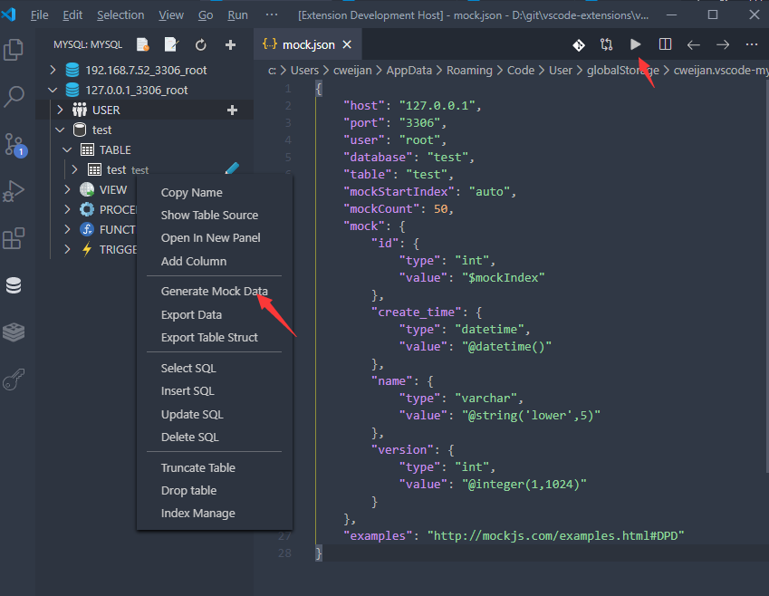

# Database Client

[](https://marketplace.visualstudio.com/items?itemName=cweijan.vscode-mysql-client2) [](https://marketplace.visualstudio.com/items?itemName=cweijan.vscode-mysql-client2) [](https://marketplace.visualstudio.com/items?itemName=cweijan.vscode-mysql-client2)

Database Client for Visual Studio Code. It supports databases MySQL/MariaDB, Microsoft SQL Server, PostgreSQL, Redis, and ElasticSearch.

> Project site: [vscode-database-client](https://github.com/cweijan/vscode-database-client), [中文文档](README_CN.md)

## Features

- [Database Client](#database-client)
  - [Connect](#connect)
  - [Table](#table)
  - [Execute SQL Query](#execute-sql-query)
  - [Generate Mock Data](#generate-mock-data)
  - [History](#history)
  - [Backup/Import](#backupimport)
  - [Filter](#filter)

## Installation

Launch VS Code Quick Open (Ctrl+P), paste the following command, and press enter.

```
ext install cweijan.vscode-mysql-client2
```

## Connect

1. Open Database Explorer panel, then click the `+` button.
2. Select your database type, input your database connection information then click the connect button.


## Table

1. Click table to open table view.
2. Then you can do data modification on the view page.


## Execute SQL Query

In the Database Explorer panel, click the `Open Query` button.


Now you can edit and run SQL query within the editor.


## Generate Mock Data

Now you do not need to spend time writing test data.



## History

Click the history button to open the list of recently executed query history records.


## Backup/Import

Move to ant DatabaseNode or TableNode. The export/import options are listed in the context menu (right click to open).


## Filter


## Credits

- [vscode-mysql](https://github.com/formulahendry/vscode-mysql): The original version of this extension.
- [mysqldump](https://github.com/bradzacher/mysqldum): Data dump lib.
- [sql-formatter](https://github.com/zeroturnaround/sql-formatter) Sql format lib.
- [umy-ui](https://github.com/u-leo/umy-ui): Result view render.
- Core Lib:
  - [node-mysql2](https://github.com/sidorares/node-mysql2) : Mysql client.
  - [node-postgres](https://github.com/brianc/node-postgres): PostgreSql client.
  - [tedious](https://github.com/tediousjs/tedious): SqlServer client.

## RoadMap

- Sync database struct from diffrent connection.
