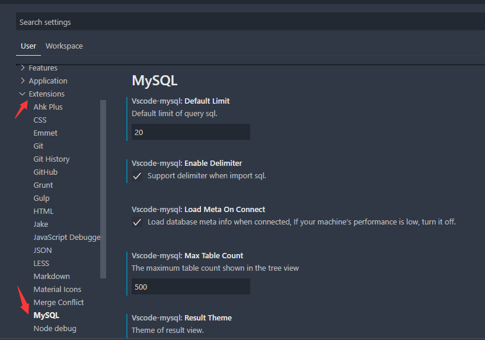
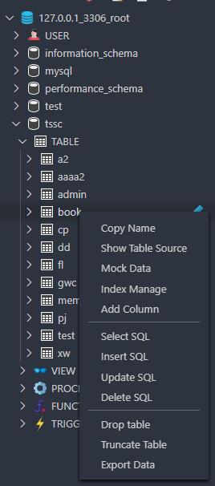

# MySQL Client

[](https://marketplace.visualstudio.com/items?itemName=cweijan.vscode-mysql-client2) [](https://marketplace.visualstudio.com/items?itemName=cweijan.vscode-mysql-client2) [](https://marketplace.visualstudio.com/items?itemName=cweijan.vscode-mysql-client2) 

MySQL Client For Visual Studio Code


> This plugin was inspired by [MySQL](https://github.com/formulahendry/vscode-mysql).
> 
> Give [project](https://github.com/cweijan/vscode-mysql) a star to keep me motivated to keep updating.

## Regarding MySQL 8.0 support

While this plugin can connect to a MySQL 8.0 server, the newer authentication methods are not supported.

To change a user's authentication method to the older one supported by this plugin, run the following query:

```sql
alter user my_user@'%' identified with mysql_native_password by "myPassword";
```


**Features**

- [MySQL Client](#mysql-client)
  - [Connect](#connect)
  - [View Tables](#view-tables)
  - [Execute Sql](#execute-sql)
  - [Generate Mock Data](#generate-mock-data)
  - [History](#history)
  - [Backup/Import](#backupimport)
  - [Setting](#setting)
  - [Other](#other)

## Connect

1. Open MySQL Panel, then click the `+` button.
2. Input your connect info then click connect.


## View Tables

1. Click Table To Open Query page and Load data.
2. You can do data modification on query page.


## Execute Sql

* In the MySQL Panel, click the `New Query` button.

* This changes the active database.
* Now you can enjoy Intellisense for SQL code within the editor.
* Click Run Button or Press `F9` to Execute.


## Generate Mock Data
- Now you do not need spend time writing test data.


## History
- Click history button to open run history record.


## Backup/Import

* Move to ant DatabaseNode or TableNode, backup/import options are listed in the context menu (right click to open).


## Setting

OpenSetting -> extensions -> Mysql



## Other
* Find a suprise when you right click on a node.



## Sponsor
- [IDEA](https://www.jetbrains.com/)

