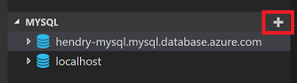
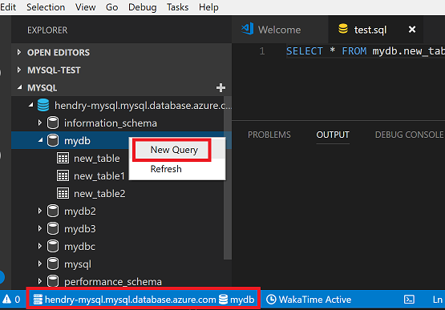

# MySQL

[](https://marketplace.visualstudio.com/items?itemName=formulahendry.vscode-mysql) [](https://marketplace.visualstudio.com/items?itemName=formulahendry.vscode-mysql) [](https://marketplace.visualstudio.com/items?itemName=formulahendry.vscode-mysql) [](https://travis-ci.org/formulahendry/vscode-mysql)

MySQL management tool

## Features

* Manage MySQL Connections (support SSL connection)
* List MySQL Servers
* List MySQL Databases
* List MySQL Tables
* List MySQL Columns
* Run MySQL Query

## Usage

* To add MySQL connection: in Explorer of VS Code, click "MYSQL" in the bottom left corner, then click the `+` button, then type host, user, password, port and certificate file path (optional) in the input box.



* To run MySQL query, open a SQL file first then:
  * right click on the SQL file, then click `Run MySQL Query` in editor context menu
  * or use shortcut `Ctrl+Alt+E`
  * or press `F1` and then select/type `Run MySQL Query`


* To create a new MySQL query or change active MySQL connection (You could see active MySQL connection in status bar):
  * right click on a MySQL server, then click `New Query`
  * or right click on a MySQL database, then click `New Query`



## Settings

* `vscode-mysql.maxTableCount`: The maximum table count shown in the tree view. (Default is **500**)

## Telemetry data

By default, anonymous telemetry data collection is turned on to understand user behavior to improve this extension. To disable it, update the settings.json as below:
```json
{
    "vscode-mysql.enableTelemetry": false
}
```

## Change Log

See Change Log [here](CHANGELOG.md)

## Issues

Currently, the extension is in the very initial phase. If you find any bug or have any suggestion/feature request, please submit the [issues](https://github.com/formulahendry/vscode-mysql/issues) to the GitHub Repo.
