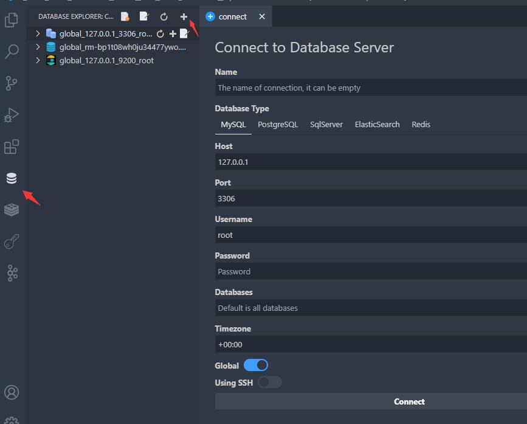
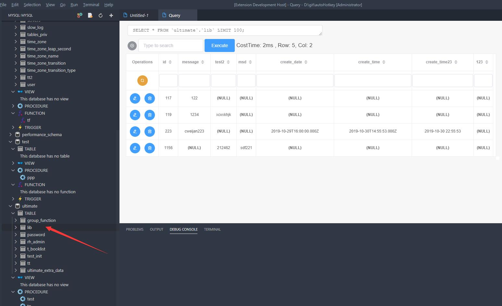
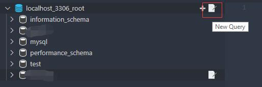
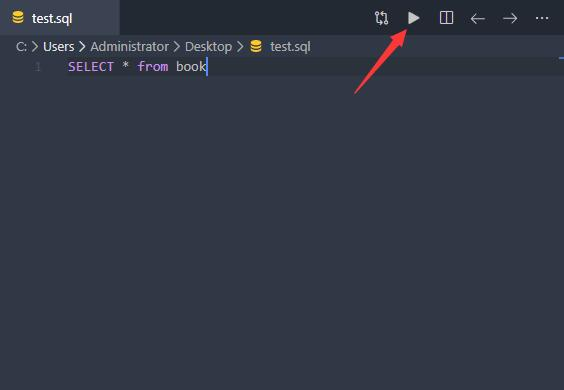
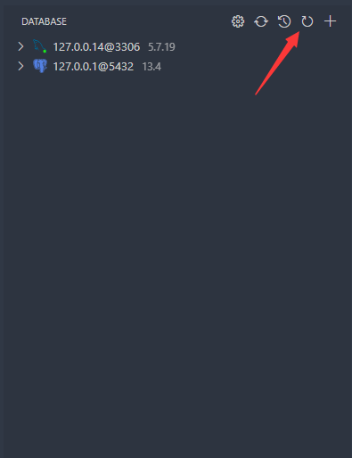
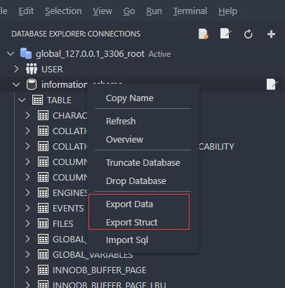
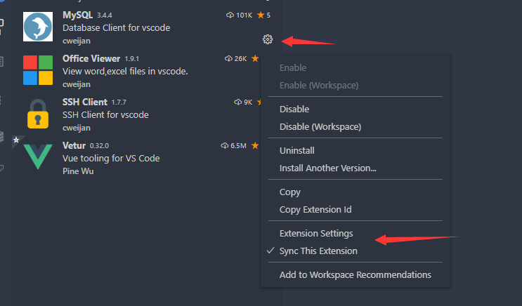
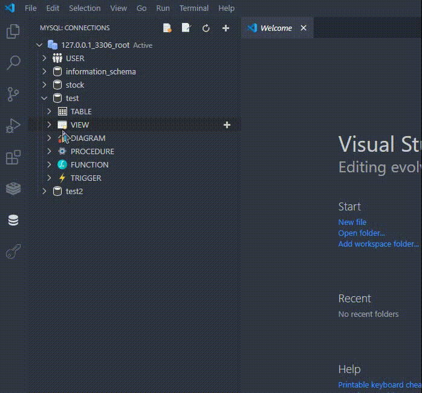
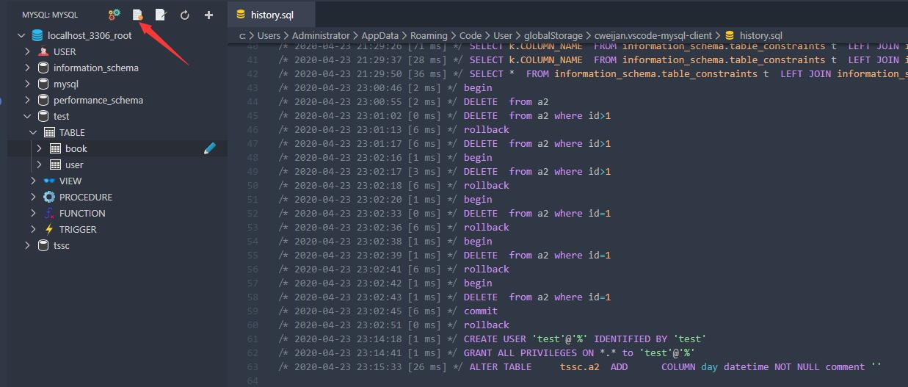

# Database Client for Visual Studio Code

  
  
  
  

 

该项目为Visual Studio Code的数据库客户端扩展, 支持**MySQL/MariaDB, PostgreSQL, SQLite, Redis, ClickHouse, 达梦**以及**ElasticSearch**的管理, 且可以作为一个SSH客户端, 最大程度地提高你的生产力!

开发这个扩展我花了大量的精力, 然而时常收到不友好评价, 仅仅是因为这些人对某个功能不满意.

对于一个免费软件, 这严重降低了作者的积极性, 所以我决定将其转为付费软件, 现在用户需要付费才可以使用全部功能, 中国区高级版价格为68元1年, 需反馈问题可加Q群706495803.

## 功能

- [连接](#连接)
- [数据表](#数据表)
- [执行SQL](#执行SQL)
- [备份/导出](#备份/导出)
- [设置](#设置)
- [表过滤](#表过滤)
- [生成测试数据](#生成测试数据)
- [历史记录](#历史记录)

## 安装

在 Visual Studio Code 扩展中心安装 [Database Client](https://marketplace.visualstudio.com/items?itemName=cweijan.vscode-mysql-client2).

## 连接

1. 打开左侧数据库面板, 点击添加按钮
2. 在连接页面配置相应的数据库信息

创建两个面板是因为部分情况下你需要同时查看SQL和NoSQL的数据, 可通过长按拖动面板到另一个里面.

## 数据表

1. 点击数据库表打开数据页, 点击表旁边的按钮则是打开新的数据页.
2. 之后就可在页面进行CRUD、数据导出(**Excel、JSON**)等操作.

## 执行SQL

点击数据库节点的 `Open Query` 按钮.

将会打开新的SQL编辑器, 可编辑和执行SQL, 提供了以下功能

1. SQL自动补全.
2. snippets:`sel、del、ins、upd、joi.`
3. 执行已选择或当前光标SQL (快捷键: Ctrl+Enter).
4. 执行全部SQL (快捷键: Ctrl+Shift+Enter).

注意: 扩展由Nodejs开发, Nodejs不支持同名属性, 所以你需要避免在你的查询中出现同名列, 否则结果无法显示完整.

该扩展支持了codelen, 但不支持存储过程和函数, 如果你经常使用他们, 则建议禁用codelen.

## 缓存

为了提高性能，缓存了数据库信息，如果你的数据库结构在外部发生了变更，需要点击以下按钮刷新缓存。

## 备份/导入

在表或者数据库节点右击, 之后便可以进行数据的导入导出; 扩展实现了备份功能, 但不够稳定, 可将mysql_dump或pg_dump加到环境变量, 扩展就会使用这些工具进行备份.

## 设置

该扩展包含一些设置, 可通过以下方式进行设置, 默认的设置就可以得到最好的使用体验, 不用纠结.

## 表过滤

用于快速筛选表, 如果有输入框可简化搜索操作, 但不幸的是VSCode并不支持该功能.

## 生成测试数据

- 该扩展提供一键生成虚拟数据的功能, 再也不用为没有测试数据而烦恼.

## 历史记录

- 点击历史记录按钮后可查看以往执行的Sql记录.

## 致谢

- [sql-formatter](https://github.com/zeroturnaround/sql-formatter) Sql格式化库.
- [umy-ui](https://github.com/u-leo/umy-ui): 表数据渲染库.
- [ssh2](https://github.com/mscdex/ssh2): SSH连接库.
- 核心连接库:

  - [node-mysql2](https://github.com/sidorares/node-mysql2) : MySQL连接库.
  - [node-postgres](https://github.com/brianc/node-postgres): PostgreSQL连接库.
  - [tedious](https://github.com/tediousjs/tedious): SqlServer连接库.
  - [ioredis](https://github.com/luin/ioredis): Redis连接库.
  - [vscode-sqlite](https://github.com/AlexCovizzi/vscode-sqlite): SQLite连接代码参考.
