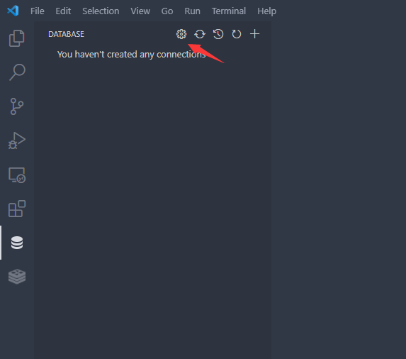
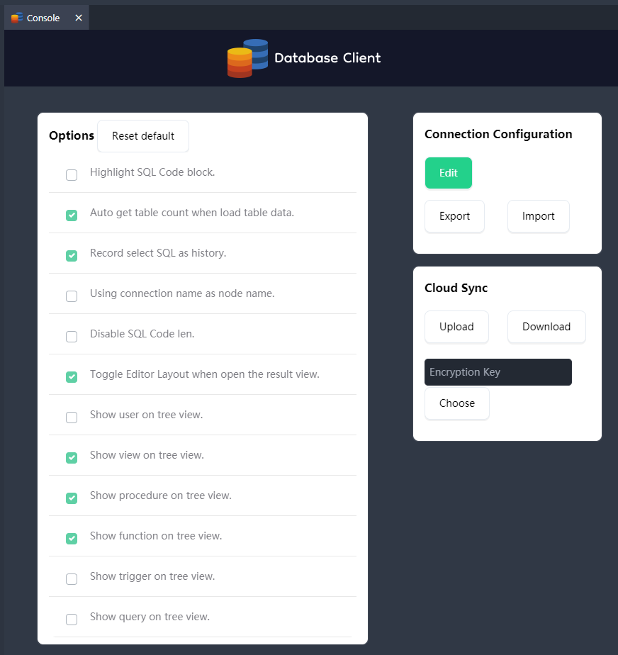

# Console

By clicking this button to open the console, where you can modify extension settings, export and import config, and perform cloud synchronization of connection config

Cloud synchronization can specify an encryption key, and DES encryption and decryption will be performed through the key during cloud synchronization to ensure your data security

