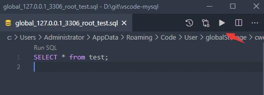

# SQL

## 执行

点击数据库节点的 `Open Query` 按钮.

将会打开新的SQL编辑器, 可编辑和执行SQL, 提供了以下功能

1. SQL自动补全.
2. snippets:`sel、del、ins、upd、joi.`
3. 执行已选择或当前光标SQL (快捷键: Ctrl+Enter).
4. 执行全部SQL (快捷键: Ctrl+Shift+Enter).

注意: 扩展由Nodejs开发, Nodejs不支持同名属性, 所以你需要避免在你的查询中出现同名列, 否则结果无法显示完整.

该扩展支持了codelen, 但不支持存储过程和函数, 如果你经常使用他们, 则建议禁用codelen.

